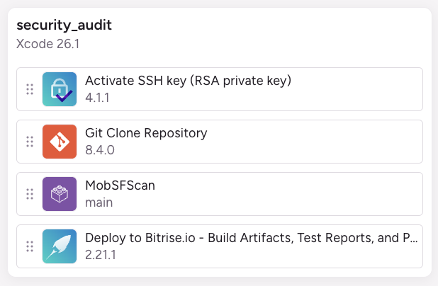
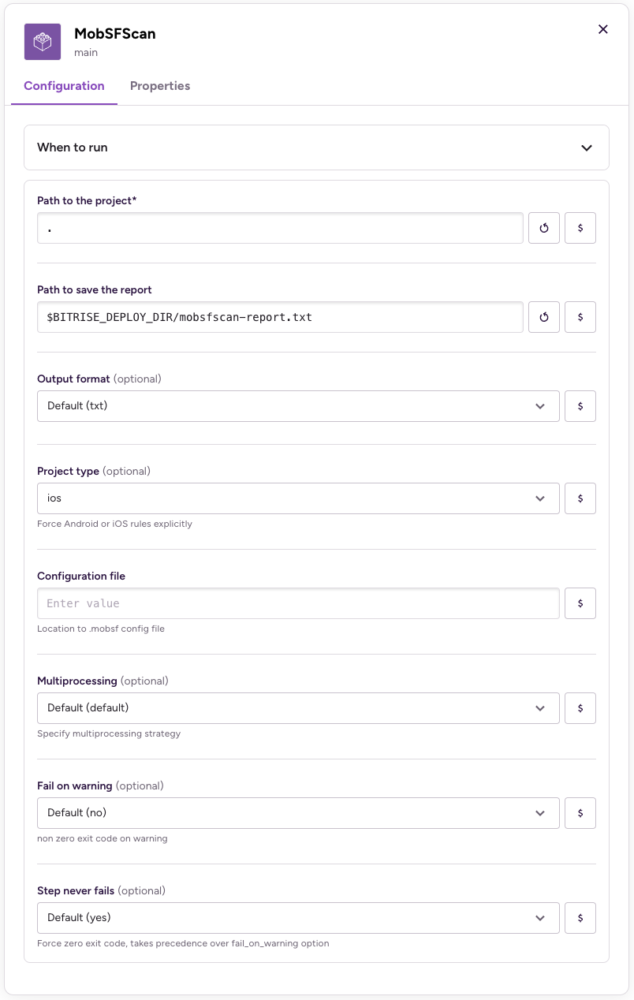

# MobSFScan - Bitrise step

[MobSFScan](https://github.com/MobSF/mobsfscan) is a static analysis tool (SAST) that can find insecure code patterns in your Android and iOS source code.  
Supports Java, Kotlin, Android XML, Swift and Objective-C Code.  
It uses [MobSF](https://github.com/MobSF/Mobile-Security-Framework-MobSF) static analysis rules.

This approved [Bitrise step](https://bitrise.io/integrations/steps/mobsfscan) will:
- run MobSFScan to audit your mobile app
- generate a report 

MobSFScan is compliant with LGPL-3.0, meaning you can use this tool in your project, even if your project is proprietary or commercial.

## Usage

### Basic integration

Open the UI editor
- Select your workflow
- Click on `add a step`
- Search for `MobSFScan`
- Select this step
- Customize the inputs in the panel

Or open `bitrise.yml` and add this step:
```yml
- mobsfscan@1: {}
```

### Repo integration

If you want to target this repository (to use a specific branch for example).
Open `bitrise.yml` to edit your workflow:
1. Add a step to reference this repository.  
Later you can customize some options from the side panel in the UI editor.
2. Add `deploy-to-bitrise-io` to save the report generated by this step.

```yml
- git::https://github.com/OhMyApp/bitrise-step-mobsfscan.git@main: {}
- deploy-to-bitrise-io@2: {}
```

### Full workflow recipe

Copy-paste this `security_audit` workflow in your `bitrise.yml`:

```yml
security_audit:
  steps:
  - activate-ssh-key@4:
      run_if: '{{getenv "SSH_RSA_PRIVATE_KEY" | ne ""}}'
  - git-clone@8.4: {}
  - mobsfscan@1:
      title: 'MobSFScan'
      inputs:
      - project_path: "."
      - project_type: ios
      - report_file_path: "$BITRISE_DEPLOY_DIR/mobsfscan-report.txt"
      - output_format: txt
      - multiprocessing: default
      - fail_on_warning: 'no'
      - no_fail: 'yes'
  - deploy-to-bitrise-io@2: {}
```



### Configure options

Once the step is added in your workflow, the UI editor will help you to customize the options:



You will be able to:
- choose the report format (txt, json, sonarqube, sarif, html)
- ignore some rules with a config file
- choose severity level if you wish to break the CI

All details are available at the [MobSFScan repository](https://github.com/MobSF/mobsfscan).

### Output sample

With a json format:

```json
{
    "errors": [],
    "mobsfscan_version": "0.4.5",
    "results": {
        "ios_cert_pinning": {
            "metadata": {
                "cwe": "CWE-295: Improper Certificate Validation",
                "description": "This app does not have Certificate Pinning implemented in code.",
                "masvs": "MSTG-NETWORK-4",
                "owasp-mobile": "M3: Insecure Communication",
                "reference": "https://github.com/MobSF/owasp-mstg/blob/master/Document/0x05g-Testing-Network-Communication.md#testing-custom-certificate-stores-and-certificate-pinning-mstg-network-4",
                "severity": "INFO"
            }
        },
        "ios_custom_keyboard_disabled": {
            "metadata": {
                "cwe": "CWE-919: Weaknesses in Mobile Applications",
                "description": "This app does not have custom keyboards disabled.",
                "masvs": "MSTG-PLATFORM-11",
                "owasp-mobile": "M1: Improper Platform Usage",
                "reference": "https://github.com/MobSF/owasp-mstg/blob/master/Document/0x06h-Testing-Platform-Interaction.md#app-extensions",
                "severity": "INFO"
            }
        }
    }
}
```
